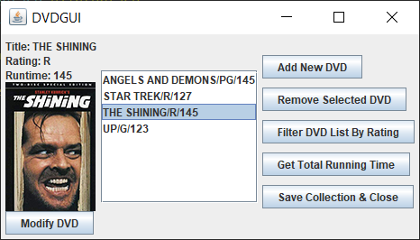

# DVD Manager GUI in Java Swing
CSUEB CS-401 Software Development SP2019

### Screenshots

### Notes
- You can add new DVDs to your collection by using the GUI or editing the database (dvddata.txt)
- You can add coverart for any title by adding a JPG image file of the same name to the program's running directory.

### Assignment Instructions
Your assignment is to create a better GUI for the assignment 2 DVD Manager application. You are given a starter window called, "DVDGUI.java."  This window contains buttons to run the commands and input boxes to collect the data. It’s pretty simple so lets spruce it up a bit. Add the following features to the existing GUI.

* Remove all command console output and provide functionality and feedback for all commands within the GUI window.
* Change the DVD Manager main program to only show the GUI and remove the option to show the command line interface.
* Provide a list of DVDs (from the DVD array) so the user can select one of them for show and editing.
* Provide a means to select a DVD from the array and functionality to display the DVD information including title, rating and total running time to the screen using the GUI components.
* Provide a means to easily edit the DVD information for each of the titles in the DVD list.
* Provide an image for each of the DVDs. You can use generic images or create specific ones for each DVD. That is, you can use themes or genre related images or specific ones.
* Add one extra GUI feature of your choice. This can be any complimentary functionality or new feature or GUI component. You can be creative and add a new feature if you wish.

 
